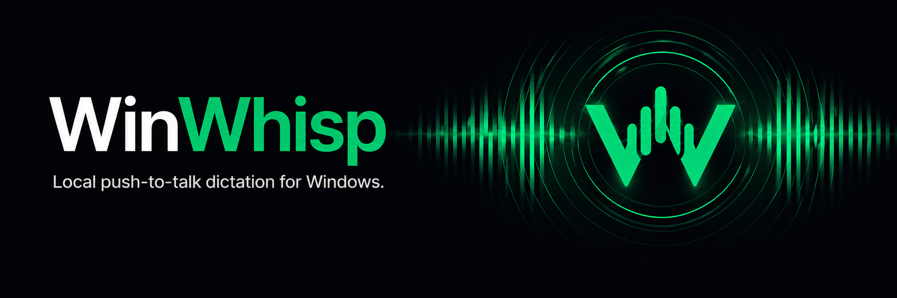

<p align="center">
  
</p>

<h1 align="center">WinWhisp</h1>

<p align="center"><strong>Hold to talk. Release to type.</strong></p>

<p align="center">
  Local push-to-talk dictation for Windows.<br/>
  Press a hotkey, speak, release — your words get pasted into the focused field.
</p>

<p align="center">
  <a href="https://github.com/Sayrrexe/WinWhisp/releases/latest">
    
  </a>
  <a href="https://github.com/Sayrrexe/WinWhisp/releases">
    
  </a>
  <a href="https://github.com/Sayrrexe/WinWhisp/actions/workflows/release.yml">
    
  </a>
  
</p>

---

WinWhisp is an offline dictation tool for Windows. Hold the hotkey, speak, let go — the transcript is typed into whatever app you have focused: chat, IDE, browser, document. The model and your audio never leave the machine.

- **Local.** `faster-whisper large-v3` on your GPU. No cloud, no telemetry.
- **Live chunking.** Audio is split on silence (VAD) and transcribed while you are still talking.
- **Idle unload.** Model leaves VRAM after 60 s of silence and warms back up on the next press.
- **Release tail.** 500 ms of audio is captured after release, in case you let go a hair too early.
- **Vocabulary.** Hotwords for beam search, regex replacements, and a built-in block-list for Whisper's silence hallucinations.
- **Overlay.** A small pill shows a live equalizer while recording, a spinner while processing, and a "paste again" button when focus was lost.

## Install

Grab the latest build from **[Releases](https://github.com/Sayrrexe/WinWhisp/releases/latest)**:

| Asset | What it is |
| --- | --- |
| `WinWhisp-<version>-setup.exe` | Inno Setup installer. Asks about start-menu shortcut and autostart. |
| `WinWhisp-<version>-portable.zip` | Unpack and run `winwhisp.exe`. No shortcuts, no autostart. |

> **SmartScreen warning.** Builds are not code-signed. On first launch Windows will say "Windows protected your PC" — click **More info → Run anyway**. The warning fades once the binary picks up reputation.

On first launch a short onboarding picks the Whisper model, hotkey, and autostart, then downloads the model into `%APPDATA%\WinWhisp\models\`.

> **Don't trust an unsigned `.exe`?** Build it yourself: see **[BUILDING.md](BUILDING.md)** for a from-source install via `uv` and a fully reproducible installer build.

WinWhisp checks GitHub for new releases every 6 hours and adds an "⟳ Update available" item to the tray menu. Download and reinstall is manual.

## Requirements

- Windows 10 or 11 x64.
- NVIDIA GPU with a recent driver (tested on RTX 3060 12 GB, driver 591.86 / CUDA 13.1). The CUDA toolkit is **not** required — `nvidia-cublas-cu12` and `nvidia-cudnn-cu12` ship as pip wheels.
- No GPU? Set `asr.device: cpu` and `asr.compute_type: int8` in the config — it works, just slower.

## Use it

1. Hold the hotkey (default: `right ctrl`).
2. Speak.
3. Release.

The transcript is pasted into the focused field via `Ctrl+V`. Taps shorter than `min_hold_ms` (250 ms) are dropped. If focus changed during processing, the text is copied to the clipboard and the overlay shows a "Paste again" button.

## Configuration

Config and vocabulary live in `%APPDATA%\WinWhisp\` — `config.yaml` and `vocab.yaml`. Models and logs are there too.

```yaml
hotkey:
  combo: right ctrl
  min_hold_ms: 250
  release_tail_ms: 500

audio:
  chunk_min_s: 1.5
  chunk_max_s: 8.0
  chunk_silence_s: 0.25
  chunk_silence_rms: 0.015

asr:
  model: large-v3
  compute_type: float16   # or int8_float16, int8
  device: cuda            # or cpu
  language: ru
  idle_unload_s: 60

injection:
  on_focus_change: notify # notify | inject | skip
```

```yaml
# vocab.yaml
hotwords:
  - gitignore
  - pull request
  - PySide6

replacements:
  "гит игнор": "gitignore"
  "коммит":   "commit"

hallucinations:
  - "Спасибо за просмотр."
  - "~DimaTorzok"
```

Edit YAML, then **Tray → Reload config**. Changing hotkey, model, device, or overlay size needs a full restart.

## Troubleshooting

<details>
<summary><strong><code>right ctrl</code> fires on left Ctrl too</strong></summary>

The code reads `event.name == "right ctrl"` directly, which works on most layouts. If it doesn't on yours, pick a different combo in `config.yaml`.
</details>

<details>
<summary><strong><code>cublas64_12.dll not found</code></strong></summary>

`uv pip list | findstr nvidia` should list `nvidia-cublas-cu12` and `nvidia-cudnn-cu12`. If they are missing, `uv sync` again.
</details>

<details>
<summary><strong>Nothing gets pasted into Task Manager / elevated windows</strong></summary>

UIPI blocks `Ctrl+V` from a non-elevated process. Run WinWhisp as administrator.
</details>

<details>
<summary><strong>Whisper inserted "Thanks for watching" or similar garbage</strong></summary>

Common YouTube-style closers in Russian and English are already in `BUILTIN_HALLUCINATIONS` (`src/transcrb/text/vocab.py`). For new phrases, add them to `vocab.yaml → hallucinations` (prefix `~` for substring match) and reload the config from the tray.
</details>